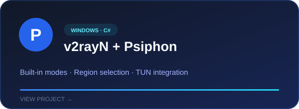
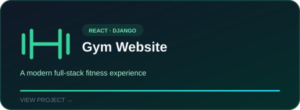
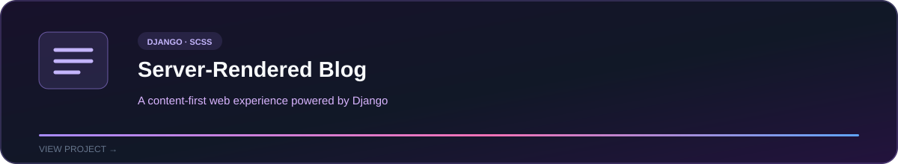

<div align="center">
  
</div>

<br />

<div align="center">
  <a href="https://github.com/M-Noferesti?tab=repositories"></a>
  <a href="https://github.com/M-Noferesti"></a>
</div>

## About me

I build practical products across the web and Windows desktop. My work combines **Django and React applications**, **server-rendered experiences**, and **C# networking tools**. I care about interfaces that feel clear, systems that are easy to maintain, and software that solves a real problem.

```text
Current focus  →  Windows networking, Psiphon integration, and full-stack products
Core stack     →  Python · Django · React · JavaScript · C# · .NET
Approach       →  Build, test, simplify, ship
```

## Selected work

<table>
  <tr>
    <td width="50%">
      <a href="https://github.com/M-Noferesti/v2rayN">
        
      </a>
    </td>
    <td width="50%">
      <a href="https://github.com/M-Noferesti/React-Django-Gym_Website">
        
      </a>
    </td>
  </tr>
  <tr>
    <td colspan="2">
      <a href="https://github.com/M-Noferesti/SSR-Django-Blog-Website">
        
      </a>
    </td>
  </tr>
</table>

## Toolkit

<div align="center">


</div>

---

<div align="center">
  <sub>Open to building useful software and improving the tools people rely on.</sub>
</div>
