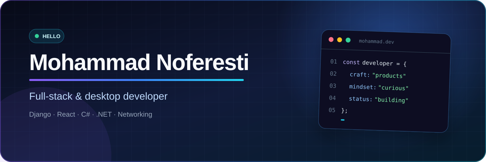

<div align="center">
  
</div>

<br />

<div align="center">
  <a href="https://github.com/M-Noferesti?tab=repositories"></a>
  <a href="https://github.com/M-Noferesti"></a>
</div>

## About me

I am a **full-stack web developer** building modern products with Django, React, Python, and JavaScript. Right now, I am mostly exploring **vibe coding**: turning ideas into working web experiences quickly, then refining them into useful products.

```text
Current focus  →  Vibe coding and full-stack web products
Core stack     →  Python · Django · React · JavaScript
Approach       →  Imagine, build, refine, ship
```

## Toolkit

<div align="center">


</div>

---

<div align="center">
  <sub>Open to building useful software and improving the tools people rely on.</sub>
</div>
